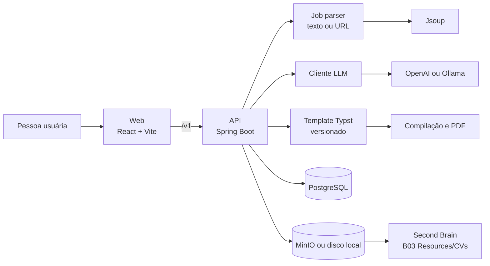
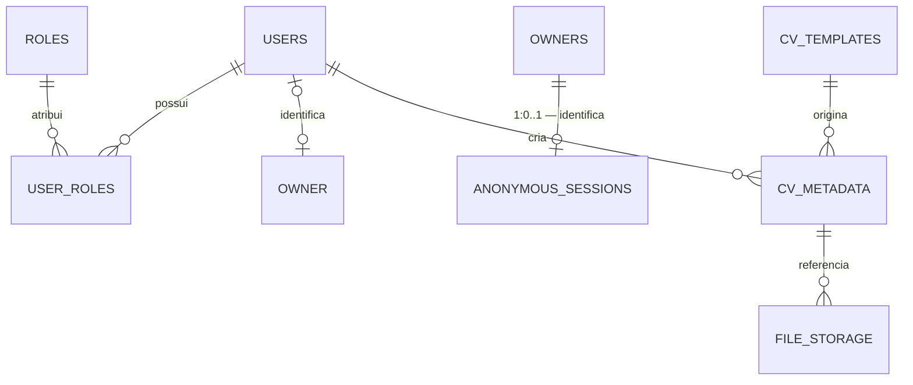

# Tailorly

Monorepo para gerar currículos personalizados para cada vaga. O produto recebe uma descrição ou URL de oportunidade, extrai os requisitos, adapta um currículo a partir de um template versionado e disponibiliza os artefatos para download e acompanhamento no Second Brain.

> **Estado atual:** fundação em andamento. O monorepo, a aplicação web, a API Spring Boot, o proxy local, CORS, Actuator, autenticação JWT e os serviços locais de PostgreSQL e MinIO já existem. O fluxo completo de sessões anônimas, o domínio de geração de currículos e integrações externas ainda estão planejados.

## Objetivo e escopo

O Tailorly busca reduzir o trabalho manual de adaptação de currículos, aumentar a aderência às palavras-chave relevantes para sistemas ATS e manter o histórico das candidaturas no vault.

O fluxo alvo é: receber e validar o Currículo Base → aprovar seus fatos como Ground Truth → receber a vaga → extrair requisitos → preencher um template Typst com os fatos aprovados → gerar PDF/Markdown → persistir os artefatos conforme o tipo de sessão → registrar a versão no vault quando a integração estiver habilitada.

## Arquitetura alvo



Os blocos de parsing, LLM, templates, PDF, storage e vault representam a arquitetura planejada. Hoje a API já implementa contas, JWT, owners e registros básicos de sessões anônimas; ingestão e geração de currículos ainda não estão disponíveis.

## Estrutura do repositório

| Caminho | Papel | Estado |
| --- | --- | --- |
| `apps/web` | Interface React para criação, edição, prévia e download de currículos. | Scaffold disponível |
| `services/api` | API HTTP e orquestração do fluxo de geração. | Scaffold disponível |
| `compose.yaml` | PostgreSQL 17 e MinIO para desenvolvimento local. | Disponível |
| `turbo.json` | Orquestra tarefas do monorepo. | Disponível |
| `pnpm-workspace.yaml` | Define os workspaces `apps/*` e `services/*`. | Disponível |

### Frontend

| Aspecto | Implementação |
| --- | --- |
| Runtime | React 19, TypeScript e Vite 7 |
| Estilos e componentes | Tailwind CSS 4, Base UI e componentes locais |
| Roteamento | TanStack Router, com geração a partir de `apps/web/src/pages` |
| Dados remotos | TanStack Query; o `QueryClient` é compartilhado no contexto do router |
| Estado local | Zustand, com sete stores em `apps/web/src/stores` e `resetClientState()` para os fluxos de saída e expiração de sessão |
| Integração local | Proxy de `/v1` para `http://localhost:8080` |

A home fica em `apps/web/src/pages/_app/_home/index.tsx` e corresponde a `/`; rotas dinâmicas usam `$id.tsx`; e `pages/__root.tsx` define o layout raiz. O prefixo de arquivo `_app` não aparece na URL. O arquivo `apps/web/src/routeTree.gen.ts` é gerado pelo plugin do TanStack Router e não deve ser alterado manualmente.

**A documentação completa do frontend está em `apps/web/README.md`**: rotas, design system e tokens, as seis dimensões de revisão, regras de pendências, as sete stores e suas guardas de contexto, fluxo da revisão rápida, e o inventário de testes. Ela substitui os READMEs internos que existiam em `src/stores/` e `src/pages/_app/base/`.

Os ícones da interface usam `@react-zero-ui/icon-sprite` (Lucide e Tabler). O `prebuild` de `apps/web` executa `zero-icons`, que gera `public/icons.svg` apenas com os ícones importados; o Vite inclui esse sprite no build. Em desenvolvimento, a biblioteca renderiza os SVGs diretamente. O `components.json` usa `lucide` para o gerador shadcn; componentes adicionados por ele devem trocar os imports gerados para `@react-zero-ui/icon-sprite`.

### API

A documentação detalhada da implementação Spring Boot está em [`services/api/README.md`](services/api/README.md).

| Aspecto | Implementação atual | Evolução prevista |
| --- | --- | --- |
| Runtime | Java 21 e Spring Boot 3.5 | — |
| HTTP e validação | Spring Web, Validation, endpoints de usuários e owners, OpenAPI/Swagger UI | Endpoints de geração de currículo |
| Saúde | Spring Actuator com `health` e `info` expostos | Métricas e logs estruturados |
| Acesso web | CORS, JWT Bearer e RBAC persistido (`ROLE_USER`/`ROLE_ADMIN`) | Política por ambiente e renovação de tokens |
| Parsing de páginas | Dependência Jsoup já incluída | Extração de vagas por URL |
| Dados e arquivos | PostgreSQL via Spring Data JPA; MinIO disponível no Compose, ainda sem integração com a API | Flyway e adaptadores de storage |

O Actuator pode ser consultado em `http://localhost:8080/actuator/health`. A especificação OpenAPI está em `http://localhost:8080/v3/api-docs` e a interface Swagger UI em `http://localhost:8080/swagger-ui.html`. A API inclui operações de usuários, owners e sessões anônimas. Cadastro (`POST /v1/auth/register` e o caminho existente `POST /v1/users`), login (`POST /v1/auth/login`), saúde, documentação e criação/validação de sessões anônimas são públicos; consulta e revogação de sessões exigem `ROLE_ADMIN`. O login valida email e senha e retorna `accessToken`, `tokenType: Bearer`, `expiresAt` e os dados públicos do usuário. Nas chamadas protegidas, envie `Authorization: Bearer <accessToken>`. O token é assinado com HS256, expira após uma hora e inclui o ID do usuário como sujeito. A API consulta a conta e as roles atuais em cada chamada protegida; contas desativadas perdem acesso imediatamente. Como a autenticação usa apenas o cabeçalho Bearer, não há cookie de login nem token CSRF. Ainda não há refresh token, logout ou revogação individual de JWTs.

Antes de iniciar a API, defina uma chave Base64 com pelo menos 32 bytes e mantenha-a estável entre reinicializações:

```bash
export TAILORLY_JWT_SECRET="$(openssl rand -base64 32)"
pnpm --filter @tailorly/api dev
```

Trocar a chave invalida todos os tokens emitidos anteriormente. Não a inclua no repositório. Fora do ambiente local, defina também `TAILORLY_JWT_ISSUER` com a URL pública da API; o valor padrão é `http://localhost:8080`.

As roles `ROLE_USER` e `ROLE_ADMIN` são criadas na inicialização e persistidas em `roles`/`user_roles`. Todo cadastro recebe `ROLE_USER`. Para definir administradores locais, informe uma lista de e-mails separada por vírgulas antes de iniciar a API:

```bash
export TAILORLY_ADMIN_EMAILS=admin@example.com,other-admin@example.com
pnpm --filter @tailorly/api dev
```

Na inicialização, usuários existentes cujos e-mails estejam na lista recebem `ROLE_ADMIN`; novos cadastros configurados na lista já são criados com as duas roles. A configuração adiciona privilégios de administrador e não remove roles previamente persistidas.

As respostas de erro usam `Accept-Language`. Estão disponíveis mensagens em inglês (padrão) e português do Brasil:

```http
Accept-Language: en
Accept-Language: pt-BR
```

Isso inclui validação, erros de domínio, autenticação (`401`) e autorização (`403`). Sem o cabeçalho, a API responde em inglês.

| Endpoint | Método | Operação |
| --- | --- | --- |
| `/v1/auth/register` | `POST` | Cadastrar usuário (`email`, `password`); retorna `201` e dados públicos. `/v1/users` continua disponível. |
| `/v1/auth/login` | `POST` | Validar `email` e `password`; retorna JWT Bearer, expiração e dados públicos ou `401`. |
| `/v1/owners` | `POST` | Criar owner (`kind`, `userId` opcional e `activeSnapshotId` opcional) |
| `/v1/owners/{id}` | `GET` | Consultar owner |
| `/v1/owners/{id}/active-snapshot` | `PATCH` | Atualizar ou limpar o snapshot ativo |
| `/v1/owners/{id}/increment-revision` | `PATCH` | Incrementar atomicamente a revisão |
| `/v1/anonymous-sessions` | `POST` | Criar sessão para owner anônimo |
| `/v1/anonymous-sessions/validate` | `POST` | Validar token e expiração da sessão |
| `/v1/anonymous-sessions/{id}/revoke` | `PATCH` | Revogar sessão (`ROLE_ADMIN`) |
| `/v1/anonymous-sessions/{id}` | `GET` | Consultar sessão (`ROLE_ADMIN`) |

## Requisitos

### Requisitos funcionais

| ID | Requisito | Descrição | Prioridade | Estado |
| --- | --- | --- | --- | --- |
| RF01 | Ingestão de vaga | Aceitar descrição da vaga por texto ou URL. | Alta | Planejado |
| RF02 | Extração de requisitos | Identificar responsabilidades, qualificações e palavras-chave relevantes. | Alta | Planejado |
| RF03 | Geração de currículo | Produzir currículo personalizado a partir dos requisitos e do perfil base. | Alta | Planejado |
| RF04 | Exportação | Disponibilizar o currículo em PDF e Markdown. | Média | Planejado |
| RF05 | Metadados e histórico | Salvar autoria, data, status, template e referência do arquivo gerado. | Média | Planejado |
| RF06 | Integração com Second Brain | Copiar/registrar artefatos em `B03 Resources/CVs/` e criar link para uso no Obsidian. | Alta | Planejado |
| RF07 | Acesso e autenticação | Permitir uso anônimo com sessão temporária e cotas; exigir conta para histórico persistente, com papéis quando necessários. | Alta | Planejado |
| RF08 | Due diligence de empresas | Consolidar sinais públicos para apoiar a decisão de candidatura, com fatores e fontes rastreáveis. | A definir | Backlog |

### Requisitos não funcionais

| ID | Requisito | Critério ou diretriz | Prioridade |
| --- | --- | --- | --- |
| RNF01 | Desempenho | Gerar um currículo em até 30 segundos, considerando o tempo de provedores externos. | Alta |
| RNF02 | Escalabilidade | Suportar até 100 usuários simultâneos como referência inicial. | Média |
| RNF03 | Segurança | Proteger dados e credenciais; aplicar autenticação, autorização e configuração por ambiente. | Alta |
| RNF04 | Usabilidade | Oferecer uma interface clara para envio da vaga, revisão e download do resultado. | Média |
| RNF05 | Manutenibilidade | Manter responsabilidades separadas, templates versionados, migrações e testes automatizados. | Média |
| RNF06 | Compatibilidade | Suportar as versões atuais dos principais navegadores. | Média |
| RNF07 | Resiliência | Usar Ollama como alternativa quando o provedor remoto de LLM falhar e storage local quando MinIO não estiver disponível. | Média |
| RNF08 | Observabilidade | Expor saúde da aplicação e evoluir para métricas e logs JSON. | Média |

## Modelo de dados planejado

| Entidade | Campos principais | Responsabilidade |
| --- | --- | --- |
| `users` | `id`, `email`, `password_hash`, `enabled` | Credenciais e estado da conta. |
| `owners` | `id`, `kind`, `user_id`, `active_snapshot_id`, `revision`, `expires_at` | Identidade proprietária de dados; `user_id` é opcional e único. `active_snapshot_id` aponta para o snapshot aprovado quando o modelo de snapshots existir. |
| `anonymous_sessions` | `id`, `owner_id`, `token_hash`, `expires_at`, `revoked_at` | Sessão anônima com token armazenado como hash e expiração/revogação no servidor; cada owner tem no máximo uma sessão. |
| `roles` | `id`, `name` | Papéis de acesso, como `ADMIN` e `USER`. |
| `user_roles` | `user_id`, `role_id` | Associação muitos-para-muitos entre usuários e papéis. |
| `cv_templates` | `id`, `name`, `content`, `version` | Templates Typst versionados para apresentação; os fatos aprovados do Currículo Base são o Ground Truth. |
| `cv_metadata` | `id`, `filename`, `created_at`, `status`, `owner_id`, `template_id` | Histórico e situação de cada currículo gerado. |
| `file_storage` | `id`, `file_path`, `cv_metadata_id` | Referência do artefato no MinIO ou armazenamento local. |



## Decisão de produto: Currículo Base como Ground Truth

Esta seção descreve o **fluxo alvo**, ainda não implementado de ponta a ponta. O Currículo Base é a fonte dos fatos pessoais e profissionais; o template Typst controla apenas a apresentação. Uma conta ou sessão anônima pode ter **um Ground Truth ativo** por vez, mas versões anteriores podem existir para auditoria e para identificar a origem de currículos já gerados.

### Processamento, versões e pendências

1. Ao receber um arquivo, calcular no servidor um hash do conteúdo (por exemplo, SHA-256) e consultar versões **no escopo da mesma conta ou sessão anônima**. Um arquivo idêntico já processado reutiliza a extração e os fatos; não executa OCR nem duplica registros. Uma nova visita anônima após a expiração da sessão pode exigir novo processamento. Não fazer deduplicação global entre pessoas.
2. Para arquivo novo, criar uma versão candidata. Extrair texto diretamente de PDF/DOC/DOCX quando possível e usar OCR nas páginas que precisarem. Extrair fatos estruturados com IA, preservando, para cada fato, o trecho ou página de origem, o estado de revisão e as versões do extrator, modelo, prompt e esquema.
3. Criar pendências ligadas à versão candidata para fatos ambíguos, ausentes, conflitantes ou sensíveis ao tempo. O usuário pode confirmar, corrigir ou omitir cada fato. Mudanças de arquivo não herdam respostas automaticamente; confirmações de fatos ainda atuais podem ser reaproveitadas somente após comparação e validação. Um arquivo idêntico dispensa novo OCR, mas pode exigir nova confirmação de fatos como vínculo de emprego atual.
4. Ativar a nova versão somente depois das confirmações obrigatórias, em uma operação que desativa a anterior. Enquanto a candidata é processada ou revisada, a versão ativa anterior permanece válida. A geração usa um snapshot imutável dos fatos aprovados e registra a versão do Ground Truth e da vaga usada; ela não reexecuta OCR para cada vaga.
5. Uma atualização do pipeline pode propor uma nova extração, sem sobrescrever silenciosamente fatos corrigidos ou confirmados. Saída em JSON válido ou com esquema rígido não equivale a exatidão factual; o snapshot aprovado evita que novas execuções da IA alterem o Ground Truth sem revisão.

**Trocar**, **desativar** e **excluir** são operações diferentes. Trocar ativa uma nova versão após revisão. Desativar deixa a conta ou sessão sem Ground Truth ativo, sem apagar automaticamente o histórico. Excluir remove arquivo, texto extraído, fatos e pendências da versão solicitada; o produto deve informar o efeito sobre currículos gerados anteriormente, que também podem conter os mesmos dados pessoais. Uma solicitação de exclusão completa deve abranger esses artefatos conforme a política de retenção definida para o produto.

### Uso sem conta e persistência

| Aspecto | Sessão anônima | Conta autenticada |
| --- | --- | --- |
| Identidade | Identificador de sessão assinado no servidor; sem cadastro. | Identidade da conta. |
| Estado | Arquivo temporário, extração, fatos, pendências e snapshot aprovado com expiração automática (TTL). | Versões, revisões e histórico persistentes. |
| Deduplicação | Hash reutilizado somente enquanto a sessão existir. | Hash reutilizado entre envios da mesma conta. |
| Limites | Cotas de tamanho e páginas, processamento, gerações e taxa de requisições verificadas no servidor. | Limites do plano ou da conta. |
| Fim do ciclo | Expiração ou remoção apaga dados temporários; não há histórico durável. | Exclusão explícita e política de retenção. |

A sessão anônima pode usar armazenamento temporário no servidor, mesmo sem criar um usuário no banco relacional. `sessionStorage` no navegador guarda apenas estado de interface; não é fonte confiável para cotas, cache de OCR ou fatos aprovados. A API protege credenciais e aplica limites. Se a pessoa criar conta antes da expiração, oferecer a migração do snapshot já processado e revisado para a conta, sem repetir OCR. Sem migração, os dados expiram. A interface de “Últimos Currículos Gerados” deve mostrar um estado vazio ou de prévia para visitantes sem histórico, nunca exemplos como se fossem documentos reais da pessoa.

### Dados a modelar

Além de `users`, templates e artefatos gerados, o domínio precisará representar versões do Currículo Base, execuções de extração, fatos com evidência e estado de revisão, pendências e respostas, sessões anônimas com TTL e a referência de cada currículo gerado ao snapshot aprovado. A versão ativa deve ser única por conta ou sessão; versões anteriores não são o Ground Truth ativo. Arquivo original e texto extraído podem ficar em storage apropriado, enquanto metadados, fatos e decisões ficam no banco. As regras de retenção e exclusão devem cobrir ambos.

## Pré-requisitos

| Ferramenta | Versão |
| --- | --- |
| Node.js | 22.18.0 ou superior (ou 24.11.0 ou superior) |
| pnpm | 10.9.0 (gerenciado pelo Corepack) |
| Java | 21 |
| Docker Compose | Opcional, necessário para PostgreSQL e MinIO locais |

## Desenvolvimento

Instale as dependências e inicie os dois workspaces:

```bash
corepack enable
pnpm install
pnpm dev
```

| Serviço | Endereço |
| --- | --- |
| Web | `http://localhost:5173` |
| API | `http://localhost:8080` |
| Health check | `http://localhost:8080/actuator/health` |
| OpenAPI (JSON) | `http://localhost:8080/v3/api-docs` |
| Swagger UI | `http://localhost:8080/swagger-ui.html` |

Para iniciar apenas uma aplicação:

```bash
pnpm --filter @tailorly/web dev
pnpm --filter @tailorly/api dev
```

Para disponibilizar os serviços de apoio locais:

```bash
docker compose up -d
```

| Serviço | Endereço | Credenciais de desenvolvimento |
| --- | --- | --- |
| PostgreSQL | `localhost:5432/tailorly` | usuário `tailorly`, senha `tailorly` |
| MinIO API | `http://localhost:9000` | usuário `tailorly`, senha `tailorly-dev-password` |
| MinIO Console | `http://localhost:9001` | mesmas credenciais do MinIO |

Essas credenciais existem apenas para o ambiente local. Variáveis de ambiente e segredos de produção não devem ser versionados.

## Comandos de qualidade

| Comando | Finalidade |
| --- | --- |
| `pnpm build` | Gera o build de todos os workspaces. |
| `pnpm test` | Executa a suíte de testes do monorepo. |
| `pnpm lint` | Executa as verificações de lint. |
| `pnpm check` | Executa as checagens configuradas para os workspaces. |

## Próximos passos

- [ ] Versionar o template base Typst para apresentação e definir a extração, revisão e persistência do Currículo Base como Ground Truth.
- [ ] Implementar `POST /v1/cv/generate` para ingestão de texto ou URL.
- [ ] Adicionar extração de requisitos com OpenAI e fallback Ollama.
- [ ] Implementar a geração de PDF/Markdown, persistência com PostgreSQL/Flyway e armazenamento no MinIO.
- [ ] Documentar os futuros endpoints de domínio no OpenAPI, adicionar testes de integração e de contrato e implementar renovação/revogação de tokens.
- [ ] Integrar os artefatos gerados ao vault e preparar CI/CD com GitHub Actions.
